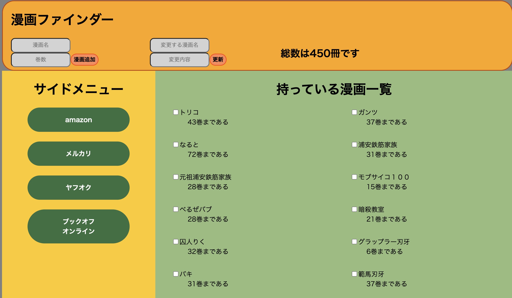
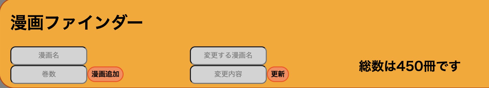
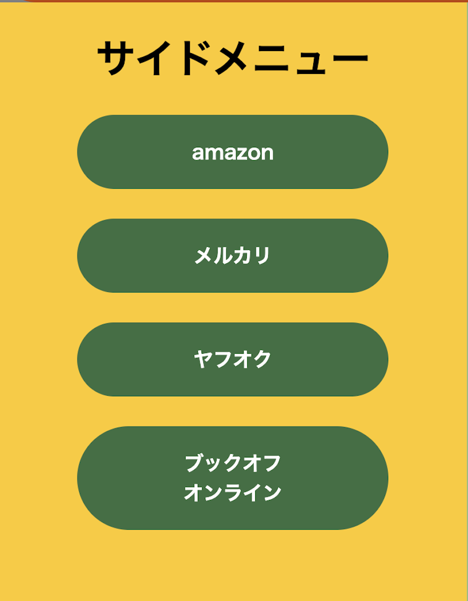
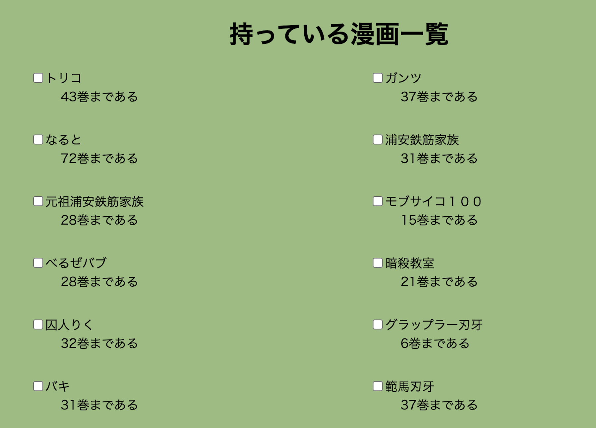

## ソロプロジェクト

## アプリ説明

作るものの全体像です。


## 環境設定

### 依存パッケージのインストールとセットアップ

まず、依存パッケージをインストールします。

```shell
　$ npm install
```

次にデータベースを作成します。
ターミナルで psql と入力し psql に入ります。

```shell
  $ psql
```

ターミナルで create database comics; で comics データベースを作成します。
この時に CREATE DATABASE と出れば成功。

> このコードを記入する際には、";（セミコロン）"を忘れないようにする。

```shell
  $ create datebase comics;
```

.env ファイルを作ります。
.env ファイルに.env.example の中身をコピーして自分の環境にあわせてください。

アプリを起動するには,MVP2 のターミナルと/frontend のターミナルでサーバーを二つ起動させる必要があります。二つともこの方法でできます。

```shell
  $ npm run dev
```

## 使い方

### トップバー



#### 漫画追加

新しく漫画を買い始めた時、
追加したい"漫画名"と"巻数"を input 欄に記入して"漫画追加"を押すと追加できます

#### 巻数更新

続きの漫画を購入した時、
変更したい"漫画名"と"変更後の巻数"を記入し、"更新"で変更されます。
変更の際に"巻数"の欄に"完結"を記入すると、紙吹雪が出てきて全巻コンプリートを祝福してくれます。

#### 漫画の総数表示

更新欄の右側に表示しているのは、DB から自動で巻数を読み取って総数を計算して表示しているものです。

### 左サイドバー



#### オンラインショップ表示

amazon、メルカリ、ヤフオク、ブックオフオンラインのボタンを押すと押したボタンのページに移動してくれます。

### 右サイドバー



#### 持っている漫画一覧表示

持っている漫画を表示してくれます。その際には、持っている漫画の巻数も表示するようになっています。

#### 誤った追加の削除

チェックボックスにチェックを入れると、削除するかしないかを選択することができ、削除する方を選んでもらうと、削除をすることができる。
